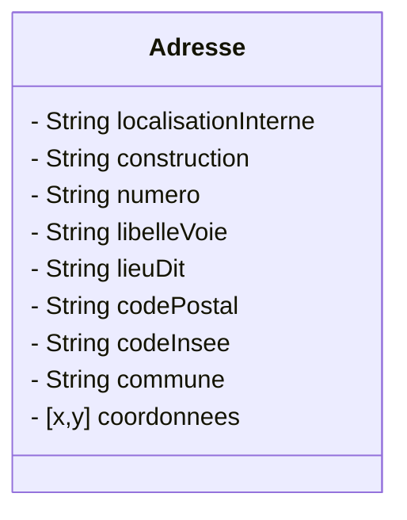

# Composants de l'application

Tous les composants de l'application se trouvent dans le dossier `\src\components`. Ces composants sont testés et leur tests unitaires respectifs se trouvent dans le dossier `\tests\unit\components\`.

## Barre de navigation

La composant barre de navigation de l'application se nomme `Navbar`.

Par défaut, les menus sont cachés si l'utilisateur n'est pas authentifié, c'est à dire si le booléen, du module store `user`, `isAuthenticated` est à `false`.
Ce comportement peut bien sûr être changé selon les besoins de l'application.

La barre de navigation se compose :

- d'un titre en 2 parties et 2 couleurs avec un lien pour revenir à la page d'accueil
- du menu de l'application avec ses différentes entrées
- Du composant de connexion décrit ci-dessous.


La barre de navigation est compatible mobile avec l'affichage classique d'un menu **burger**


La partie du menu propre à chaque application se définit dans le slot `start` :

```html
<template slot="start" v-if="isAuthenticated">
  <b-navbar-item @click="$router.push({ name: 'Clients' })">
    Client
  </b-navbar-item>
  <b-navbar-dropdown label="Info" hoverable>
    <b-navbar-item>
      Aide
    </b-navbar-item>
    <b-navbar-item>
      Contact
    </b-navbar-item>
  </b-navbar-dropdown>
</template>
```

**Propriétés**

| Nom    | Description            | Type                 | Obligatoire | Valeur par Défaut |
| ------ | ---------------------- | -------------------- | ----------- | ----------------- |
| titre1 | Début du titre en bleu | Chaîne de caractères | Oui         |                   |
| titre2 | Suite du titre en vert | Chaîne de caractères | Oui         |                   |

## Connexion

Ce composant permet de gérer la connexion à l'application.
Il se nomme `Connexion`

Les données de ce composant proviennent du store **VueX**. Le comportement du composant de connexion et du store gérant l'authentification est bouchonné pour simplifier le développement. La structure pourra être cependant conservée lors de l'intégration dans le projet squelette.

Le composant a 2 états :

- L'utilisateur n'est pas connecté, le booléen `isAuthenticated` est à `false`, on présente alors le bouton de connexion. Sur clic sur le bouton de connexion, on déclenche alors la méthode du store pour récupérer l'utilisateur, mettre à jour l'utilisateur connecté et le booléen `isAuthenticated` à `true`.
- L'utilisateur est connecté, le booléen `isAuthenticated` est à `true` et l'objet `authenticatedUser` est rempli. On présente alors le nom, prénom de l'utilisateur avec entre parenthèse son matricule et un menu déroulant proposant la déconnexion. Lors de la déconnexion, on déclenche la méthode du store pour déconnecter l'utilisateur et on revient à l'état initial.

  

::: tip Note
Le composant de **connexion** est compatible mobile et s'intègre dans la barre de navigation en mobile dans le menu **burger**.
:::

## Pied de page

Le composant pied de page se nomme logiquement `Footer`.

Il présente :

- Le logo du département
- Un lien d'aide
- Un lien de contact pour envoyer un mail vers l'assistance numérique
- Le numéro de la version


**Propriétés**

| Nom     | Description              | Type                 | Obligatoire | Valeur par Défaut |
| ------- | ------------------------ | -------------------- | ----------- | ----------------- |
| version | Version de l'application | Chaîne de caractères | Non         |                   |

## Bouton de base

Le composant `BaseButton` permet de définir un comportement et affichage cohérent des boutons de l'application.
C'est juste un composant squelette qui permet de passer les attributs, les méthodes d'un bouton avec le code suivant :

```javascript
<b-button v-on="$listeners" v-bind="$attrs">
```

Il possède aussi un slot qui permet de redéfinir le libellé.

**Exemple d'utilisation**

```html
<base-button
  title="Ajouter un enregistrement"
  libelle="Ajouter"
  type="is-success"
  icon-left="plus"
  v-if="isAdd"
  v-on:click="add"
/>
```

Avec utilisation du slot `libelle`

```html
<base-button
  type="is-link"
  title="Connexion"
  @click.native="connexion"
  v-if="!isAuthenticated"
>
  <template slot="libelle">
    <strong>Connexion</strong>
  </template>
</base-button>
```

:::: tabs

::: tab Propriétés

| Nom     | Description       | Type                 | Obligatoire | Valeur par Défaut |
| ------- | ----------------- | -------------------- | ----------- | ----------------- |
| libelle | Libellé du bouton | Chaîne de caractères | Non         |                   |

:::

::: tab Slots

| Nom     | Description       |
| ------- | ----------------- |
| libelle | Libellé du bouton |

:::

::::

## En tête de tableau

Ce composant nommé 'TabHeader` permet de gérer les en-têtes de tableau.

Par défaut, il permet d'afficher 2 boutons :

- **Ajouter** pour naviguer ver la page d'ajout d'un composant
- **Exporter** pour déclencher l'export CSV

Ces 2 boutons peuvent être cachés.

On peut ajouter aussi des boutons avant et après avec 2 slots `before` et `after`.

**Demo**

<p class="codepen" data-height="500" data-theme-id="dark" data-default-tab="result" data-user="sylvainmasson" data-slug-hash="MWammEE" style="height: 265px; box-sizing: border-box; display: flex; align-items: center; justify-content: center; border: 2px solid; margin: 1em 0; padding: 1em;" data-pen-title="ExampleTabHeader">
  <span>See the Pen <a href="https://codepen.io/sylvainmasson/pen/MWammEE">
  ExampleTabHeader</a> by Sylvain Masson (<a href="https://codepen.io/sylvainmasson">@sylvainmasson</a>)
  on <a href="https://codepen.io">CodePen</a>.</span>
</p>
<script async src="https://static.codepen.io/assets/embed/ei.js"></script>

:::: tabs

::: tab Propriétés

| Nom          | Description                         | Type                 | Obligatoire | Valeur par Défaut |
| ------------ | ----------------------------------- | -------------------- | ----------- | ----------------- |
| title        | Titre de l'en-tête                  | Chaîne de caractères | Oui         |                   |
| isAdd        | Affichage ou non du bouton d'ajout  | Booléen              | Non         |                   |
| isExportable | Affichage ou non du bouton d'export | Booléen              | Non         |                   |

:::

::: tab Évènements

| Nom          | Description                            |
| ------------ | -------------------------------------- |
| click-add    | Déclenché sur le clic du bouton ajout  |
| click-export | Déclenché sur le clic du bouton export |

:::

::: tab Slots

| Nom    | Description                      |
| ------ | -------------------------------- |
| before | Affiché avant le bouton ajouter  |
| after  | Affiché après le bouton exporter |

:::

::::

## Résultat vide

Ce composant est utilisé pour le slot `empty` du composant `b-table`, c'est à dire lorsque le tableau de données devient vide.
Il se nomme `EmptySlot`.


## Boutons d'action tableau

Ce composant permet de gérer l'affichage des trois boutons de consultation, de modification et de suppression sur chaque ligne d'un tableau.
Des boutons peuvent être ajoutés avant ou après ces boutons via des slots. Les 3 boutons peuvent chacun être affichés ou non. Enfin, une pop-in de confirmation apparaît pour la suppression.

**Demo**

<p class="codepen" data-height="400" data-theme-id="dark" data-default-tab="result" data-user="sylvainmasson" data-slug-hash="KKdmLBq" style="height: 265px; box-sizing: border-box; display: flex; align-items: center; justify-content: center; border: 2px solid; margin: 1em 0; padding: 1em;" data-pen-title="ExampleActionButton">
  <span>See the Pen <a href="https://codepen.io/sylvainmasson/pen/KKdmLBq">
  ExampleActionButton</a> by Sylvain Masson (<a href="https://codepen.io/sylvainmasson">@sylvainmasson</a>)
  on <a href="https://codepen.io">CodePen</a>.</span>
</p>
<script async src="https://static.codepen.io/assets/embed/ei.js"></script>

:::: tabs

::: tab Propriétés

| Nom         | Description                                | Type                 | Obligatoire | Valeur par Défaut |
| ----------- | ------------------------------------------ | -------------------- | ----------- | ----------------- |
| libelle     | Libellé à afficher lors de la suppression  | Chaîne de caractères | Oui         |                   |
| isReadable  | Affichage ou non du bouton de consultation | Booléen              | Non         |                   |
| isEditable  | Affichage ou non du bouton de modification | Booléen              | Non         |                   |
| isDeletable | Affichage ou non du bouton de suppression  | Booléen              | Non         |                   |

:::

::: tab Évènements

| Nom          | Description                                  |
| ------------ | -------------------------------------------- |
| click-read   | Déclenché sur le clic du bouton consultation |
| click-edit   | Déclenché sur le clic du bouton modification |
| click-remove | Déclenché sur la confirmation de suppression |

:::

::: tab Slots

| Nom    | Description               |
| ------ | ------------------------- |
| before | Affiché avant les boutons |
| after  | Affiché après les boutons |

:::

::::

## Pagination

C'est le composant qui gère la pagination dans les tableaux. Il se base sur le composant [Pagination de Buefy](https://buefy.org/documentation/pagination).

Les données de ce composant proviennent du store **VueX** `pagination`. La configuration pour un tableau est stockée dans ce store via un objet JSON identifié par son `id`. Ce qui fait que chaque modification de la configuration de pagination d'un tableau est mémorisée dans **VueX**. A chaque fois qu'un utilisateur revient sur un tableau, la configuration de la pagination est reprise.

Le composant a un comportement par défaut :

- Pagination à **oui**
- Pagination simple à **non**
- **15** éléments par page

L'affichage de la configuration de la pagination dans le composant `b-table` ne se fait pas au même endroit selon que le tableau est paginée ou non.

Si le tableau est paginée, la configuration de la pagination s'affiche dans le slot `bottom-left` alors que la pagination elle même s'affiche en bas à droite.

Si le tableau n'est pas paginée, la configuration de la pagination s'affiche dans le slot `footer`.

```javascript
<template slot="bottom-left">
  <pagination :id="id" />
</template>
<template slot="footer" v-if="!pagination.isPaginated">
  <pagination :id="id" />
</template>
```

**Demo**


**Propriétés**

| Nom | Description                                       | Type                 | Obligatoire | Valeur par Défaut |
| --- | ------------------------------------------------- | -------------------- | ----------- | ----------------- |
| id  | Identifiant de la pagination stocké dans le store | Chaîne de caractères | Oui         |                   |

## En tête de formulaire

Ce composant se nomme `FormHeader`. Il a 2 comportements :

- En ajout : il affiche un libellé de création
- En modification : il affiche un libellé de modification + un en-tête qui est généralement le libellé de l'enregistrement en cours de modification.

**Création**


**Modification**


**Propriétés**

| Nom                 | Description             | Type                 | Obligatoire | Valeur par Défaut |
| ------------------- | ----------------------- | -------------------- | ----------- | ----------------- |
| modification        | Modification ou non     | Booléen              | Oui         |                   |
| libelleCreation     | Libellé en création     | Chaîne de caractères | Oui         |                   |
| libelleModification | Libellé en modification | Chaîne de caractères | Oui         |                   |
| libelleEnTete       | Libellé en tête         | Chaîne de caractères | Oui         |                   |

## Pied de formulaire

Ce composant se nomme `FormFooter`. Il a 2 comportements différents selon que l'on soit en lecture seule ou en modification. Il a pour but d'harmoniser la validation de formulaire.

En lecture seule, il affiche un bouton retour pour naviguer sur le tableau des données.

En modification, il permet soit de valider le formulaire, soit d'annuler la saisie avec affichage d'une fenêtre de confirmation d'abandon de saisie si le formulaire a été modifiée. Il affiche aussi un libellé que les champs précédés d'un astérisque sont obligatoires.

::: tip Note
Le bouton **Valider** déclenche un `submit` du formulaire afin de vérifier que celui-ci est bien saisi avant l'enregistrement des modifications. Le comportement des formulaires (validation et annulation) est décrit ultérieurement dans la documentation.
:::

**Lecture seule**


**Modification**


**Propriétés**

| Nom         | Description           | Type    | Obligatoire | Valeur par Défaut |
| ----------- | --------------------- | ------- | ----------- | ----------------- |
| readOnly    | Lecture seule ou non  | Booléen | Oui         |                   |
| routeRetour | Objet route de retour | Objet   | Oui         |                   |

## Champ input

Le composant s'appelle `FieldInput` et permet de gérer le libellé et un champ de saisie de type `input` **HTML** en combinant le composant **Buefy** `b-field` et `b-input`.
Le libellé du champ s'affiche de manière horizontale et ajoute une astérisque si le champ est obligatoire.

::: tip Note
Pour que le caractère obligatoire, il faut impérativement passer le paramètre `required=true` et pas seulement `required`. La valeur ne pouvant alors être interprétée par le composant lui même.
:::

Ce composant se comporte en passe plat et permet de définir tous les attributs possibles sur un `b-input` et `input`.

**Exemples d'utilisation**

_Champ texte obligatoire avec longueur maximum de 50 caractères sans compteur apparent_ :

```html
<field-input
  id="nom"
  label="Nom"
  v-model="client.nom"
  type="text"
  required="true"
  maxlength="50"
  :has-counter="false"
  @input="changeNom"
/>
```

_Champ date obligatoire avec icône_ :

```html
<field-input
  id="birthdate"
  label="Date de naissance"
  v-model="client.birthdate"
  type="date"
  icon="calendar"
  required="true"
/>
```

_Champ mail obligatoire avec icône_ :

```html
<field-input
  id="email"
  label="Email"
  v-model="client.email"
  type="email"
  icon="email"
  required="true"
/>
```

_Champ téléphone avec expression régulière de validation_ :

```html
<field-input
  id="telephone"
  label="Téléphone"
  v-model="client.telephonenumber"
  icon="phone"
  pattern="[0-9]{10}"
  validation-message="Format attendu : 10 chiffres sans espaces (ex: 0240991234)"
/>
```

**Demo**


**Propriétés**

| Nom   | Description          | Type                 | Obligatoire | Valeur par Défaut |
| ----- | -------------------- | -------------------- | ----------- | ----------------- |
| id    | Identifiant du champ | Chaîne de caractères | Oui         |                   |
| label | Libellé du champ     | Chaîne de caractères | Oui         |                   |

## Champ texte riche

Le composant s'appelle `FieldRichText` et permet de gérer le libellé et un champ de saisie de type texte riche en utilisant [Vue2Editor](https://www.vue2editor.com/).
De la même manière que pour le champ input, le libellé du champ s'affiche de manière horizontale et ajoute une astérisque si le champ est obligatoire.

::: tip Note
Pour que le caractère obligatoire, il faut impérativement passer le paramètre `required=true` et pas seulement `required`. La valeur ne pouvant alors être interprétée par le composant lui même.
:::

Ce composant se comporte en passe plat et permet de définir tous les attributs possibles sur un `b-input` et `vue-editor`.

**Démo**


**Propriétés**

| Nom   | Description          | Type                 | Obligatoire | Valeur par Défaut |
| ----- | -------------------- | -------------------- | ----------- | ----------------- |
| id    | Identifiant du champ | Chaîne de caractères | Oui         |                   |
| label | Libellé du champ     | Chaîne de caractères | Oui         |                   |

## Champ adresse

Le composant `FieldAdresse` permet d'effectuer une recherche via autocompletion sur la Base d'Adresse Nationale, de renseigner la valeur sélectionnée dans un objet `Adresse` et d'afficher cette adresse sur une carte grâce à ses coordonnées latitude longitude.

Elle utilise le composant `MapMarker` décrit ci-dessous.

Pour rappel, voici la structure d'une adresse :



::: tip Note
Le composant se charge de transformer les données provenant de la **BAN** dans le format de l'adresse décrit ci-dessus.
:::

Le champ se compose comme les autres composants champ d'un libellé et d'une partie saisie obligatoire ou non.

**Demo**


**Propriétés**

| Nom      | Description                  | Type    | Obligatoire | Valeur par Défaut |
| -------- | ---------------------------- | ------- | ----------- | ----------------- |
| adresse  | Objet adresse                | Objet   | Oui         |                   |
| required | Obligatoire ou non           | Booléen | Oui         |                   |
| showMap  | Affichage de la carte ou non | Booléen | Oui         |                   |

## Carte avec marqueur

Le composant `MapMarker` permet d'afficher un marqueur grâce à ses coordonnées latitude longitude sur une carte.

Pour cela, on utilise le composant [Vue LeafLet](https://vue2-leaflet.netlify.app) qui permet de rendre réactif en **VueJS** la bibliothèque JavaScript libre de cartographie [Leaflet](https://leafletjs.com/).

Ensuite concernant la carte elle-même, on utilise **OpenStreetMap**.

**Propriétés**

| Nom         | Description                               | Type                 | Obligatoire | Exemple |
| ----------- | ----------------------------------------- | -------------------- | ----------- | ------- |
| coordonnees | Tableau de coordonnées latitude longitude | Objet                | Oui         |         |
| height      | Hauteur d'affichage de la carte en pixels | Chaîne de caractères | Oui         | 300px   |

## Téléchargement image

Le composant `FieldUploadImage` permet comme son nom l'indique de télécharger une image.

Il prend en charge les images de type **jpeg** et **png**. On définit aussi une taille maximum d'upload.

Une fois que l'image est téléchargée, un évènement est déclenché permettant de récupérer celle-ci.

**Exemple d'utilisation**

```html
<field-upload-image
  :libelleBouton="boutonAvatar"
  :maxSize="800000"
  @upload="upload"
/>
```

```javascript
/**
 * Gestion de la mise à jour de l'image
 * @param {Object} event fichier image
 */
upload(event) {
  this.imageData = event.imageData
  this.boutonAvatar = "Mettre à jour l'avatar"
}
```

**Démo**


:::: tabs

::: tab Propriétés

| Nom           | Description                                    | Type                 | Obligatoire | Valeur par Défaut |
| ------------- | ---------------------------------------------- | -------------------- | ----------- | ----------------- |
| libelleBouton | Libellé du bouton                              | Chaîne de caractères | Oui         |                   |
| maxSize       | Taille maximum de l'image téléchargée en octet | Nombre               | Oui         |                   |

:::

::: tab Évènements

| Nom    | Description                                  | Paramètres                              |
| ------ | -------------------------------------------- | --------------------------------------- |
| upload | Déclenché après le téléchargement de l'image | `imageData` données binaires de l'image |

:::

::::

## Affichage image

Le composant `FieldAvatar` permet d'afficher l'image.

Il permet soit :

- De ne rien afficher si l'url de l'avatar ou les données de l'image de l'avatar sont vides.
- D'afficher l'avatar à partir des données de l'image.
- D'afficher l'avatar à partir de son url si celle-ci est renseignée et si les données de l'image sont vides.

**Propriétés**

| Nom       | Description        | Type                 | Obligatoire | Valeur par Défaut |
| --------- | ------------------ | -------------------- | ----------- | ----------------- |
| imageData | Données de l'image | Chaîne de caractères | Non         |                   |
| avatarUrl | Url de l'avatar    | Chaîne de caractères | Non         |                   |

## Libellé valeur

Le composant `LabelValue` permet d'afficher un libellé et une valeur de manière horizontale.

Si la propriété `icon` est défini, celui-ci remplace le libellé.

L'utilisation d'un slot par défaut permet de remplacer la valeur `value` par un affichage spécifique.

Si la valeur est null, tout le champ est caché.

**Exemples d'utilisation**

_Affichage de l'avatar_

```html
<label-value label="Avatar" value="avatar" v-if="image || client.avatarUrl">
  
  
</label-value>
```

_Champ classique nom_

```html
<label-value label="Nom" :value="client.nom" />
```

_Affichage de l'adresses électronique avec icône et lien mailto sur l'email_

```html
<label-value icon="email" label="adresse électronique" :value="client.email">
  <a v-bind:href="'mailto:' + client.email">
    {{ client.email }}
  </a>
</label-value>
```

_Affichage de la carte sans libellé et sans icône_

```html
<label-value label="" value="adresse">
  <map-marker
    :coordonnees="client.adresse.coordonnees"
    height="200px"
  ></map-marker>
</label-value>
```

_Affichage de la liste des contacts_

```html
<label-value
  label="Contact"
  :value="client.contacts"
  v-if="client.contacts.length > 0"
>
  <span>
    <ul>
      <li v-for="contact in client.contacts" :key="contact.id">
        {{ contact.nomComplet }}
      </li>
    </ul>
  </span>
</label-value>
```

**Démo**


:::: tabs

::: tab Propriétés

| Nom   | Description                                              | Type                 | Obligatoire | Valeur par Défaut |
| ----- | -------------------------------------------------------- | -------------------- | ----------- | ----------------- |
| label | Libellé du champ                                         | Chaîne de caractères | Oui         |                   |
| icon  | Icône **MDI** à afficher, si icône, le libellé est caché | Chaîne de caractères | Non         |                   |
| value | Valeur du champ, si vide le champ est caché              | Chaîne de caractères | Non         |                   |

:::

::: tab Slots

| Nom     | Description                                         |
| ------- | --------------------------------------------------- |
| default | Remplacement du libellé par un affichage spécifique |

:::

::::
