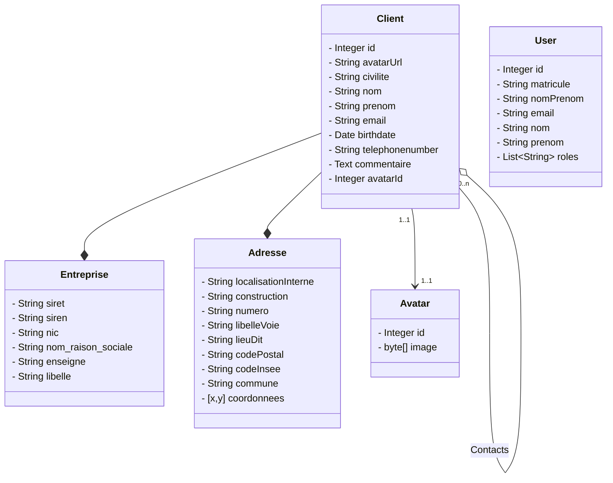

# Données et API

## Fonctionnement

Pour pouvoir simuler une API REST et avoir des données dans notre application client VueJS, nous utilisons [JsonServer](https://github.com/typicode/json-server).

Cette solution permet d'avoir une api clé en main assez complète à partir soit :

- d'une source de données JSON
- d'un script javascript index.js que l'on peut programmer.

C'est cette solution qui a été choisie avec [faker.js](https://github.com/Marak/faker.js) pour générer à chaque démarrage une nouvelle base de données contenant suffisamment de données pour pouvoir tester correctement notre application cliente.

## Modèle de données



La classe `client` est la classe principale sur laquelle est basée le CRUD, elle se compose de données personnelles et :

- d'une entreprise
- d'une adresse
- éventuellement d'un avatar qui est stockée dans l'objet JSON `avatar` en binaire

La classe `user` sert à gérer la connexion et l'authentification à l'application.

## Initialisation des données

Comme évoqué précédemment, le chargement des données se fait à l'initialisation de **JSON Server** à l'aide **faker.js** en lançant la commande suivante qui est elle même compris dans la commande `yarn start` ou `yarn db` :

```bash
json-server --watch index.js
```

Le script de chargement se nomme donc `index.js` et se trouve dans le dossier `server`.
Il exécute les étapes suivantes :

1. Importer faker.js

```javascript
var faker = require('faker/locale/fr')
```

2. Initialiser les trois collections d'objet JSON de la base de données

```javascript
const data = { clients: [], avatars: [], users: [] }
```

3. Créer 500 clients aléatoires avec leur adresse et entreprise respective :

```javascript
for (var id = 0; id < 500; id++) {
  data.clients.push({
    id: id,
    avatarUrl: faker.image.avatar(),
    civilite: faker.name.prefix(),
    nom: faker.name.lastName(),
    prenom: faker.name.firstName(),
    email: faker.internet.email(),
    // Date en ISO (YYYY-MM-DD) précédant le 1 janvier 1998 de 30 ans ou moins
    birthdate: faker.date
      .past(30, new Date('1998-01-01'))
      .toISOString()
      .substring(0, 10),
    telephonenumber: faker.phone.phoneNumberFormat(),
    commentaire: faker.lorem.paragraph(),
    entreprise: {
      siret: '39793164300092',
      siren: '397931643',
      nic: '00092',
      nom_raison_sociale: 'INSERIM',
      enseigne: null,
      libelle: 'INSERIM'
    },
    adresse: {
      localisationInterne: null,
      construction: null,
      numero: '11',
      libelleVoie: 'Rue Henri Cochard',
      lieuDit: null,
      codePostal: '44000',
      codeInsee: '44109',
      commune: 'Nantes',
      coordonnees: [47.223392, -1.549853]
    },
    contacts: []
  })
}
```

4.Créer 20 utilisateurs pour la gestion de l'authentification :

```javascript
for (var j = 0; j < 20; j++) {
  const user = faker.helpers.contextualCard()
  data.users.push({
    id: j,
    matricule: user.username,
    nomPrenom: user.name,
    email: user.email,
    nom: faker.name.lastName(),
    prenom: faker.name.firstName(),
    roles: ['ROLE_ADMINISTRATEUR']
  })
}
```

::: tip Note
La génération de l'adresse et de l'entreprise n'est pas aléatoire mais toujours la même quelque soit le client. Ce n'était pas possible simplement de rendre ces données aléatoire avec `faker.js`
:::

## Données externe

Nous utilisons les données `api.gouv.fr` pour gérer les adresses et les entreprises respectivement en utilisant les appels REST suivants :

- Recherche d'une adresse : `https://api-adresse.data.gouv.fr/search/?q=${term}&lat=47.213484&lon=-1.558216`
- Recherche d'une entreprise : `https://entreprise.data.gouv.fr/api/sirene/v1/full_text/${term}?departement=44`
- Récupération d'une entreprise à partir de son **SIRET** : `https://entreprise.data.gouv.fr/api/sirene/v3/etablissements/${siret}`

Les avatars par défaut des utilisateurs sont chargés aléatoirement par `faker.js` à partir d'amazon S3. Exemple : [https://s3.amazonaws.com/uifaces/faces/twitter/hjartstrorn/128.jpg](https://s3.amazonaws.com/uifaces/faces/twitter/hjartstrorn/128.jpg)
